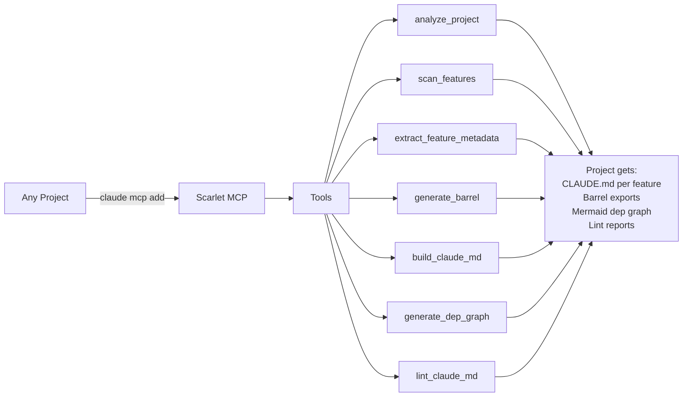
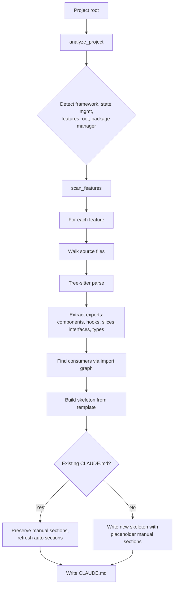
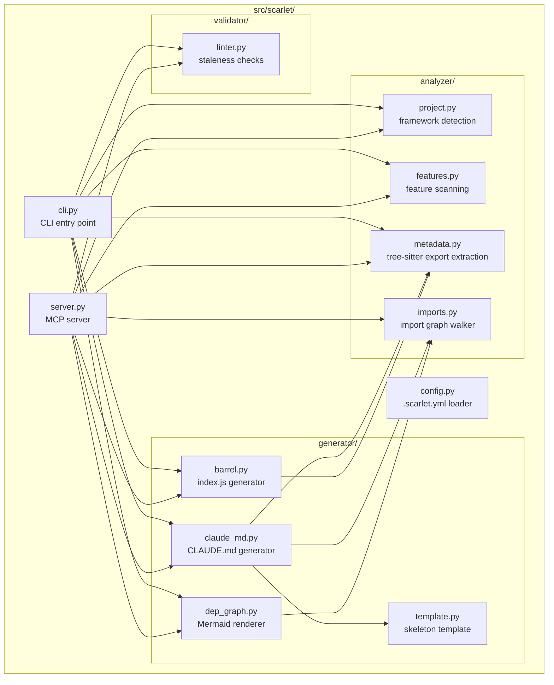
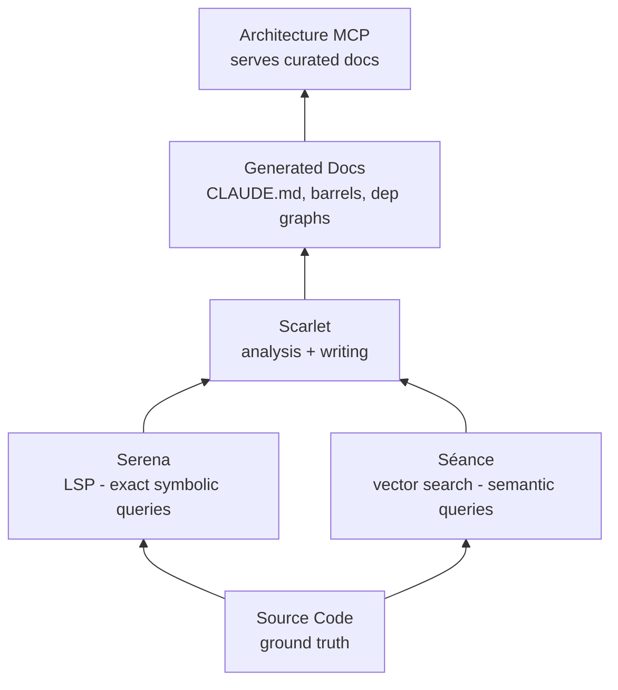

# Scarlet

> *To find what is hidden, hold a séance. To bind the names you find, give them to Scarlet.*

Scarlet is a **codebase cartographer** — an MCP server that walks any project, extracts structural metadata via tree-sitter, and generates the documentation scaffolding AI assistants need to actually understand a feature-organized codebase: per-feature `CLAUDE.md` files, barrel exports (`index.js`/`index.ts`), Mermaid dependency graphs, and symbol manifests.

Built for [Claude Code](https://docs.anthropic.com/en/docs/claude-code), but works with any MCP-compatible client.

The dark cousin of [Séance](https://github.com/fsocietydisobey/seance): Séance retrieves knowledge from the dead code via vector search; Scarlet inscribes the names of every entity into a permanent record.

## Why "Scarlet"

Named for the **Scarlet Woman of Revelation 17** — the figure who sits on a beast "full of names of blasphemy" with a name written on her forehead and a cup full of mysteries in her hand. She is defined by the inscribed names she bears. A catalog walking around in human form.

That maps directly onto what the tool does:

- Catalogs named entities (components, hooks, slices, types, interfaces) from a codebase
- Inscribes them into permanent records — per-feature `CLAUDE.md` files, barrel exports, symbol manifests
- Surfaces what was hidden — gotchas, invariants, TODOs, deep imports that bypass barrels

Other scarlet threads in scripture reinforce the metaphor:

- **Isaiah 1:18** — *"though your sins be as scarlet…"*. Scarlet was the dye that couldn't be washed out; the stain that remained visible. Documentation fixes structure in the same way — makes the shape of a feature indelible so refactors can't silently erase it.
- **Rahab's scarlet cord** (Joshua 2:18) — a visible marker placed on the house that should be preserved when everything around it is destroyed. Every generated `CLAUDE.md` is a scarlet cord: a feature tied to an inscription so it survives refactors that would otherwise erase its shape.

There's also Hawthorne's **Scarlet Letter** — a public mark that fixes identity, making a person's defining characteristic impossible to ignore. Scarlet does the same to features: once their symbols are inscribed, their identity is legible to anyone (or anything) reading the record.

And it pairs with its sibling tool in the ritual:

> *To find what is hidden, hold a séance. To bind the names you find, give them to Scarlet.*

[Séance](https://github.com/fsocietydisobey/seance) is the summoning. Scarlet is the scribe at the ritual — the one who takes down what comes through.

## What it does



## The core principle

**Deterministic parts run in Python. Judgment parts run in Claude.**

| Generated by Scarlet (Python + tree-sitter) | Generated by Claude (synthesis) |
|---|---|
| Public API list | Vocabulary (domain terms) |
| Key files index | Conventions and invariants |
| Cross-feature consumers | Common task recipes |
| Dependency graph | Known issues and gotchas |
| Barrel exports | One-paragraph feature description |
| Symbol manifests | The *why* behind every "don't do X" |

The tools generate **structure**. Claude generates **meaning**. On every CLAUDE.md update, the auto-derivable sections refresh and the human/Claude-written sections are preserved using `<!-- BEGIN MANUAL --> ... <!-- END MANUAL -->` markers.

## Indexing pipeline



## The CLAUDE.md template

Every generated CLAUDE.md follows the same shape — auto sections refresh on every update, manual sections persist:

- **Description** (manual) — one-paragraph summary
- **Vocabulary** (manual) — domain terms specific to this feature
- **Public API** (auto) — exported components, hooks, slices, types
- **Key files** (auto) — every source file with the symbols it defines
- **Conventions and patterns** (manual) — invariants, idioms, the *why* behind every rule
- **Consumers** (auto) — features that import from this one
- **Common tasks** (manual) — step-by-step recipes
- **Known issues and gotchas** (manual) — landmines, deprecated patterns
- **See also** (auto) — cross-references to study guides and rules

## Installation

### Prerequisites

- Python 3.12+
- [uv](https://docs.astral.sh/uv/) package manager

### Setup

```bash
git clone git@github.com:fsocietydisobey/scarlet.git
cd scarlet
uv sync
```

No API keys required — Scarlet is fully local and stateless.

## CLI usage

```bash
# Scan a project — overview + feature table
uv run scarlet scan ~/work/jeevy_portal

# Generate or refresh one feature's CLAUDE.md
uv run scarlet describe ~/work/jeevy_portal drawings
uv run scarlet describe ~/work/jeevy_portal drawings --dry-run   # preview only

# Refresh all feature CLAUDE.md files
uv run scarlet sync ~/work/jeevy_portal

# Generate a barrel export for a feature
uv run scarlet barrel ~/work/jeevy_portal drawings --ext js

# Generate a Mermaid dependency graph
uv run scarlet graph ~/work/jeevy_portal -o shared-docs/feature-deps.mmd

# Lint all CLAUDE.md files for staleness and missing sections
uv run scarlet lint ~/work/jeevy_portal

# Start the MCP server
uv run scarlet serve
```

## MCP integration

### Claude Code

Register globally so it's available in every project:

```bash
claude mcp add -s user scarlet -- uv --directory /path/to/scarlet run scarlet serve
```

Once registered, Claude gets these tools:

| Tool | What it does |
|---|---|
| `analyze_project` | Detect framework, state mgmt, package manager, feature count |
| `scan_features` | List all features with state (CLAUDE.md, barrel, counts) |
| `extract_feature_metadata` | Pull all exports from one feature |
| `generate_barrel` | Create a barrel export file for one feature |
| `build_claude_md` | Generate or refresh a feature's CLAUDE.md |
| `generate_dep_graph` | Output Mermaid or JSON dependency graph |
| `lint_claude_md` | Validate a feature's CLAUDE.md for staleness |
| `list_consumers` | Find all features that import from a given feature |

### Other MCP clients

```json
{
  "mcpServers": {
    "scarlet": {
      "command": "uv",
      "args": ["--directory", "/path/to/scarlet", "run", "scarlet", "serve"]
    }
  }
}
```

## Configuration

Create a `.scarlet.yml` at the root of any project to declare conventions:

```yaml
project_type: nextjs
state_management: redux-toolkit
test_framework: jest
features_root: frontend/src/features
study_guides_path: frontend/study-guides
barrel_export_strategy: re_export_default
```

This makes Scarlet reusable across projects with different shapes. Without `.scarlet.yml`, Scarlet uses sensible defaults and detects most things heuristically.

## Architecture



## Composition with Séance and Serena

Scarlet is the **writer**. It produces structure for the read tools to consume:



| Tool | Question it answers | Mode |
|---|---|---|
| **Serena** | *"Where is symbol X defined? Who calls it?"* | Read (LSP-precise) |
| **Séance** | *"Find code related to concept X"* | Read (semantic-fuzzy) |
| **Scarlet** | *"Generate or refresh the structural docs"* | **Write** |
| **Architecture MCP** | *"What does the curated map say about X?"* | Read (curated prose) |

The four together form a complete loop: Scarlet writes, the others read.

## Tech stack

- **[tree-sitter](https://tree-sitter.github.io/)** — AST parsing for Python, TypeScript, JavaScript
- **[MCP Python SDK](https://github.com/modelcontextprotocol/python-sdk)** — Model Context Protocol server
- **[Click](https://click.palletsprojects.com/)** — CLI framework
- **[PyYAML](https://pyyaml.org/)** — Config file parsing
- **[uv](https://docs.astral.sh/uv/)** — Package management

No vector database, no API keys, no embeddings. Scarlet is fully local, deterministic, and stateless.

## License

MIT
